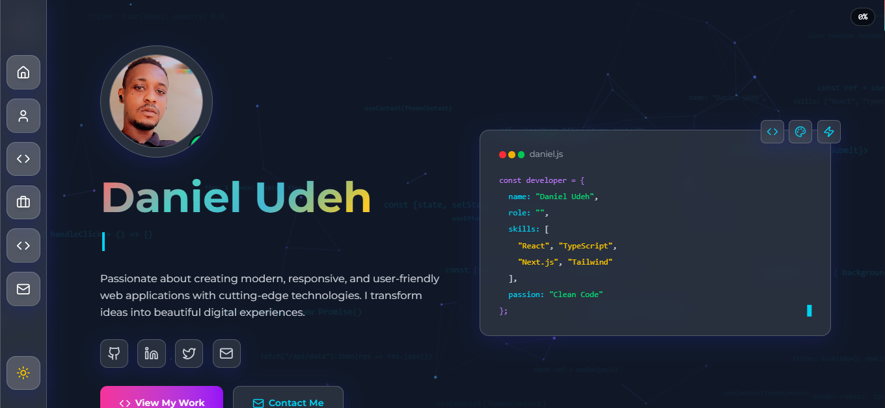

# 🚀 Daniel Udeh - Frontend Developer Portfolio



A modern, responsive, and interactive portfolio website showcasing my skills as a frontend developer. Built with cutting-edge technologies and featuring stunning animations, dark mode, and a clean, professional design.

## ✨ Features

### 🎨 **Modern Design & UI**
- **Glassmorphism Effects** - Beautiful backdrop blur and transparency effects
- **Dark Theme by Default** - Modern dark mode with smooth transitions
- **Responsive Design** - Optimized for all devices (mobile, tablet, desktop)
- **Accessibility First** - WCAG compliant with proper contrast and navigation

### 🎭 **Interactive Animations**
- **Framer Motion Animations** - Smooth scroll-triggered and hover animations
- **Falling Code Snippets** - Dynamic background with real code falling across the screen
- **Particle Effects** - Subtle background particles for visual depth
- **Micro-interactions** - Hover effects, button animations, and loading states

### 🧭 **Navigation & UX**
- **Fixed Left Sidebar** - Clean vertical navigation with animated icons
- **Mobile-First Menu** - Slide-out mobile menu with smooth animations
- **Scroll to Top Button** - Appears after scrolling with smooth scroll behavior
- **Theme Toggle** - Persistent dark/light mode switching

### 📱 **Sections & Content**
- **Hero Section** - Animated introduction with floating elements
- **About Section** - Professional journey timeline and expertise showcase
- **Skills Section** - Interactive skill cards with progress bars and icons
- **Projects Section** - Featured projects with modal details and live demos
- **Contact Section** - Functional contact form with EmailJS integration
- **Footer** - Social links and professional branding

### 🛠️ **Technical Features**
- **Performance Optimized** - Fast loading with code splitting and lazy loading
- **SEO Friendly** - Proper meta tags and semantic HTML
- **Contact Integration** - EmailJS for form submissions
- **Local Storage** - Theme preferences persistence

## 🛠️ Tech Stack

### **Frontend Framework**
- **React 19** - Latest React with modern hooks and concurrent features
- **Vite** - Fast build tool with HMR and optimized production builds

### **Styling & UI**
- **Tailwind CSS v4** - Utility-first CSS framework with custom utilities
- **Framer Motion** - Production-ready motion library for React
- **Lucide React** - Beautiful & consistent icon library
- **React Icons** - Popular icon packs for enhanced UI

### **Development Tools**
- **ESLint** - Code linting and formatting
- **Vite Plugins** - Optimized React and Tailwind integration
- **Modern JavaScript** - ES6+ features and best practices

### **Additional Libraries**
- **EmailJS** - Client-side email sending for contact forms
- **React Router** - Client-side routing (if needed for future expansion)

## 🚀 Getting Started

### Prerequisites
- Node.js (v16 or higher)
- npm or yarn package manager

### Installation

1. **Clone the repository**
   ```bash
   git clone https://github.com/diddy0077/new-portfolio.git
   cd my-portfolio
   ```

2. **Install dependencies**
   ```bash
   npm install
   ```

3. **Start development server**
   ```bash
   npm run dev
   ```

4. **Open your browser**
   ```
   http://localhost:5173
   ```

### Build for Production

```bash
npm run build
```

### Preview Production Build

```bash
npm run preview
```

## 📁 Project Structure

```
my-portfolio/
├── public/
│   ├── vite.svg
│   └── assets/
├── src/
│   ├── components/
│   │   ├── About.jsx          # About section with timeline
│   │   ├── Contact.jsx        # Contact form with EmailJS
│   │   ├── Footer.jsx         # Footer with social links
│   │   ├── Hero.jsx           # Hero section with animations
│   │   ├── Loading.jsx        # Loading screen component
│   │   ├── MiniProjects.jsx   # Additional projects showcase
│   │   ├── Navbar.jsx         # Navigation with sidebar
│   │   ├── Particles.jsx      # Background particle effects
│   │   ├── Projects.jsx       # Main projects section
│   │   ├── ScrollProgress.jsx # Scroll progress indicator
│   │   ├── ScrollToTop.jsx    # Scroll to top button
│   │   ├── Skills.jsx         # Skills with icons and animations
│   │   ├── FallingText.jsx    # Animated falling code snippets
│   │   └── Loading.jsx        # Loading screen
│   ├── context/
│   │   └── ThemeContext.jsx   # Theme management
│   ├── App.jsx                # Main application component
│   ├── index.css              # Global styles and Tailwind
│   └── main.jsx               # Application entry point
├── package.json
├── vite.config.js
├── tailwind.config.js
├── eslint.config.js
└── README.md
```

## 🎨 Customization

### **Personal Information**
Update your details in the respective components:
- **Hero Section**: `src/components/Hero.jsx` - Name and tagline
- **About Section**: `src/components/About.jsx` - Journey and skills
- **Contact Section**: `src/components/Contact.jsx` - Contact information

### **Projects**
Add your projects in `src/components/Projects.jsx`:
```javascript
{
  title: "Your Project",
  shortDescription: "Brief description",
  description: "Detailed description",
  technologies: ["Tech1", "Tech2"],
  image: "path/to/image",
  github: "https://github.com/username/project",
  live: "https://project-demo.com",
  featured: true
}
```

### **EmailJS Integration**
For the contact form to work:
1. Sign up at [EmailJS](https://www.emailjs.com/)
2. Create a service and template
3. Update credentials in `src/components/Contact.jsx`

### **Theme Customization**
Modify colors and styling in:
- `src/index.css` - Global styles and custom utilities
- Tailwind classes throughout components
- Theme context in `src/context/ThemeContext.jsx`

## 📱 Responsive Design

The portfolio is fully responsive with breakpoints:
- **Mobile**: < 768px
- **Tablet**: 768px - 1024px
- **Desktop**: > 1024px

Key responsive features:
- Mobile-first sidebar navigation
- Adaptive grid layouts
- Touch-friendly interactions
- Optimized typography scaling

## 🌟 Key Highlights

- **Modern Tech Stack** - Latest React 19 with Vite
- **Performance Focused** - Optimized loading and animations
- **Accessibility Compliant** - WCAG guidelines followed
- **SEO Optimized** - Proper meta tags and structure
- **Mobile Responsive** - Perfect on all devices
- **Interactive Elements** - Engaging user experience
- **Professional Design** - Clean and modern aesthetics

## 🤝 Contributing

1. Fork the repository
2. Create your feature branch (`git checkout -b feature/AmazingFeature`)
3. Commit your changes (`git commit -m 'Add some AmazingFeature'`)
4. Push to the branch (`git push origin feature/AmazingFeature`)
5. Open a Pull Request

## 📄 License

This project is open source and available under the [MIT License](LICENSE).

## 📞 Contact

**Daniel Udeh**
- **Email**: danieludeh007@yahoo.com
- **LinkedIn**: [linkedin.com/in/danieludeh](https://www.linkedin.com/in/daniel-udeh-a03971350/)
- **GitHub**: [github.com/diddy0077](https://github.com/diddy0077)
- **Portfolio**: [danieludeh.dev](https://danieludeh.netlify.app)

---

**Built with ❤️ by Daniel Udeh**

*Showcasing modern web development with React, Tailwind CSS, and cutting-edge animations*
